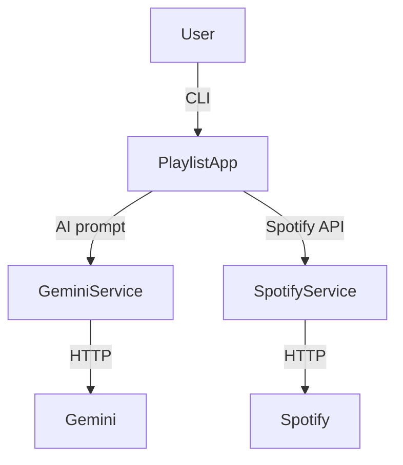

# EightyTwentyPlaylist

A .NET tool to generate and manage Spotify playlists for your training sessions using AI (Gemini) and the Spotify API.

**This tool is specifically designed to generate playlists tailored for zone-based endurance training (e.g., Zone 1, Zone 2, etc.), helping athletes and coaches create music experiences that match the structure and intensity of their workouts.**


> **Disclaimer:**
> This tool is not affiliated with, endorsed by, or connected to 8020endurance.com or its owners. All trademarks, service marks, and other intellectual property related to 8020endurance.com are the property of their respective owners. This project is an independent open-source effort and is provided for educational and personal use only.

## Folder Structure

```
/src                      # Main application source code
/tests                    # Unit and integration tests
/.github/workflows        # GitHub Actions workflows
README.md
LICENSE
.gitignore
```

## Architecture



## Features
- Generate playlists based on your training session description and preferred genres
- Automatically search and match tracks on Spotify
- Create or update a playlist on your Spotify account

## Getting Started

### Prerequisites
- [.NET 10 SDK](https://dotnet.microsoft.com/download)
- Spotify Developer account (for API credentials)
- Gemini API key

### How to get your API credentials
- [How to create your own Spotify Client ID and Client Secret](https://developer.spotify.com/documentation/web-api/tutorials/getting-started#create-an-app) (the "Create an app" section is all you need)
- [How to get a Gemini API key](https://aistudio.google.com/app/apikey)

### Setup
1. Clone the repository:
 ```sh
 git clone https://github.com/3d0it/eighty-twenty-playlist.git
 cd eighty-twenty-playlist
 ```
2. Add your configuration (see below).
3. Build and run:
 ```sh
 dotnet build
 dotnet run --project src/EightyTwentyPlaylist.Tool
 ```

### Configuration
- The `Spotify:RedirectUri` must be set in your `appsettings.json` or `appsettings.Development.json` file:

```json
{
 "Spotify": {
 "RedirectUri": "http://localhost:8888/SpotifyCallback"
 }
}
```

 > **Note:** The `RedirectUri` is an app configuration in your Spotify Developer Dashboard. When you create your Spotify app (see the "Create an app" section above), you must add this Redirect URI to your app's settings in the Spotify dashboard.

- All other secrets (Spotify ClientId, ClientSecret, Gemini ApiKey) can be set using [project secrets](https://learn.microsoft.com/en-us/aspnet/core/security/app-secrets):

```json
{
 "Spotify:ClientSecret": "YOUR_CLIENT_SECRET",
 "Spotify:ClientId": "YOUR_CLIENT_ID",
 "Gemini:ApiKey": "YOUR_GEMINI_API_KEY"
}
```

## Usage

After running the tool, follow the prompts to describe your training session and genres. The tool will:
- Generate a playlist using Gemini AI
- Search for matching tracks on Spotify
- Create or update your Spotify playlist

**Example:**
```
$ dotnet run --project src/EightyTwentyPlaylist.Tool
EightyTwentyPlaylist Tool Started
Enter total duration (e.g.60 minutes):45 minutes
Enter training session description:45 minutes zone2
Enter preferred genres (comma separated): Rock, pop
...
```

## Troubleshooting
- Ensure your Spotify app's Redirect URI matches the one in your configuration.
- Make sure your API keys/secrets are correct and not expired.

## Contributing

We welcome contributions! Please see [CONTRIBUTING.md](CONTRIBUTING.md) for guidelines on how to open issues and submit pull requests. All code should follow our style guide and include relevant tests.

## License
MIT
